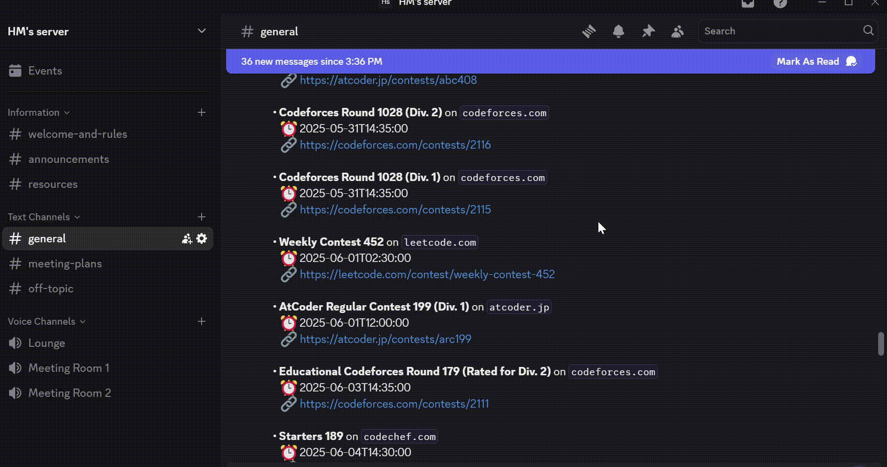

# 🤖 Discord Contest Bot

A Python-based Discord bot that **automatically posts upcoming competitive programming contests** every week to your server! Perfect for students, coders, and teams looking to stay updated on contests from platforms like LeetCode, Codeforces, CodeChef, and more.



---

## 🚀 Features

- 📅 Weekly contest schedule (auto-posts every Monday)
- 🌐 Fetches contests from major CP platforms
- 🕒 Time conversion to IST or UTC (configurable)
- 🔗 Direct clickable contest links
- ✅ Fully customizable channel ID and message format
- 💡 Lightweight and easy to host on Replit or locally

---

## 🛠️ Setup

### 1. Clone the Repository

```bash
git clone https://github.com/hirah-ma/DiscordContestBot.git
cd DiscordContestBot
```

### 2. Add Your Bot Token

Create a `.env` file in the root folder with the following:

```ini
DISCORD_TOKEN=your_discord_bot_token
CHANNEL_ID=your_target_channel_id
```

> ✅ Tip: Your `.env` file is ignored by Git using `.gitignore`.

### 3. Install Dependencies

```bash
pip install -r requirements.txt
```

### 4. Run the Bot

```bash
python main.py
```

> Or deploy using **Replit + UptimeRobot** for weekly auto-pinging.

_Remember to use /send to target the correct endpoint of the replit app

---

## 🌐 Platforms Covered

- [LeetCode](https://leetcode.com/contest/)
- [Codeforces](https://codeforces.com/)
- [CodeChef](https://www.codechef.com/)
- [AtCoder](https://atcoder.jp/)
- [HackerRank](https://www.hackerrank.com/contests)
- [...and more via Kontests API](https://kontests.net)

---

## ✨ Credits

Built by [Hirah Mohammadi Afroze](https://github.com/hirah-ma)  
Using **Python** & [discord.py](https://discordpy.readthedocs.io)


